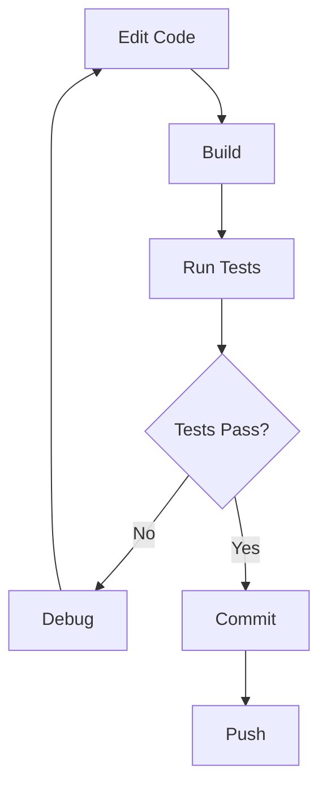

# Development Workflow and Testing

## Development Environment

### Prerequisites

- **Docker**: Container platform for isolated development
- **Git**: Version control
- **Modern C++ Compiler**: Clang 14+ or GCC 11+
- **CMake**: 3.20 or higher
- **vcpkg**: Integrated package manager

### Initial Setup

```bash
# Clone repository
git clone https://github.com/yourusername/cronus.git
cd cronus

# Build using Docker environment
./run_local.sh ./generate.sh
./run_local.sh ninja -C build/linux_x64_debug

# Run tests
./run_local.sh build/linux_x64_debug/server/cronus/cronus --help
```

## Cronus Operational Modes

Cronus supports two operational modes. The mode is automatically detected based on the directory context.

### Single-Agent Mode Setup

Use this mode when working with an existing repository and a single AI agent.

```bash
# Navigate to your existing project
cd /path/to/my-project

# Initialize Cronus in single-agent mode
cronus init

# This creates:
# .cronus/
# ├── config.json          # Agent configuration
# ├── state.json           # Agent state
# ├── tasks/               # Task tracking
# ├── context/             # Conversation history
# └── cache/               # Temporary files

# Start Cronus server
cronus serve

# Or use with CLI
cronus chat "Implement feature X"
```

**Characteristics:**
- One agent per repository
- Configuration in `.cronus/` at repo root
- Direct modification of repository files
- Persistent context across sessions

### Multi-Agent Mode Setup

Use this mode for parallel agent experimentation and comparison.

```bash
# Create a new workspace directory
mkdir my-workspace
cd my-workspace

# Initialize Cronus in multi-agent mode
cronus init --multi-agent

# This creates:
# .cronus/
# ├── multi-agent.marker
# ├── config.json          # Global configuration
# ├── shared/              # Shared resources
# └── comparison/          # Agent comparison data
#
# agents/                  # (created separately for each agent)

# Create agents from a source repository
cronus agent create alpha --source=/path/to/source/repo --model=gpt-4
cronus agent create beta --source=/path/to/source/repo --model=claude-3-opus

# This creates:
# agents/
# ├── alpha/
# │   ├── .cronus/         # Alpha's configuration
# │   ├── .git/            # Alpha's repository
# │   └── src/             # Alpha's source code
# └── beta/
#     ├── .cronus/         # Beta's configuration
#     ├── .git/            # Beta's repository
#     └── src/             # Beta's source code

# Start Cronus server (manages all agents)
cronus serve

# Interact with specific agents
cronus chat --agent=alpha "Implement feature X"
cronus chat --agent=beta "Implement feature X"

# Compare results
cronus compare alpha beta
```

**Characteristics:**
- Multiple agents with isolated repositories
- Each agent has its own repo copy
- Parallel execution
- Built-in comparison tools

## Development Workflow

### 1. Single-Agent Feature Development

```bash
# In your project directory
cd /path/to/my-project

# Ensure Cronus is initialized
cronus init  # If not already done

# Start a development session
cronus serve &

# Work on features using CLI or web interface
cronus chat "Add logging to the database module"
cronus chat "Write unit tests for the new feature"
cronus chat "Optimize the search algorithm"

# Review changes
git diff

# Commit when satisfied
git add .
git commit -m "Add logging and tests"
```

### 2. Multi-Agent Development and Comparison

### 2. Multi-Agent Development and Comparison

```bash
# Create multi-agent workspace
mkdir experiment-workspace
cd experiment-workspace

# Initialize with multiple agents
cronus init --multi-agent
cronus agent create gpt4 --source=/path/to/project --model=gpt-4
cronus agent create claude --source=/path/to/project --model=claude-3-opus
cronus agent create deepseek --source=/path/to/project --model=deepseek-coder

# Start server
cronus serve &

# Give same task to all agents
TASK="Refactor the authentication module to use dependency injection"
cronus chat --agent=gpt4 "$TASK"
cronus chat --agent=claude "$TASK"
cronus chat --agent=deepseek "$TASK"

# Compare implementations
cronus compare gpt4 claude deepseek --metric=all

# Review each agent's solution
cd .cronus/agents/gpt4/repo && git diff
cd .cronus/agents/claude/repo && git diff
cd .cronus/agents/deepseek/repo && git diff

# Select best solution and merge
cronus merge --agent=claude --to=/path/to/project
```

### 3. Cronus Development (Building Cronus Itself)

When working on the Cronus project itself:

```bash
# Clone Cronus repository
git clone https://github.com/yourusername/cronus.git
cd cronus

# Create feature branch
git checkout -b feature/new-feature

# Build using Docker
./run_local.sh ./generate.sh
./run_local.sh ninja -C build/linux_x64_debug

# Run tests
./run_local.sh build/linux_x64_debug/server/cronus/cronus --test

# Make changes in your IDE
# (Docker container mounts workspace, changes are live)

# Rebuild
./run_local.sh ninja -C build/linux_x64_debug

### 2. Iterative Development



**Quick Iteration Loop:**

```bash
# Terminal 1: Watch mode (rebuild on change)
while true; do
    inotifywait -r -e modify src/
    ./build.sh
done

# Terminal 2: Server with auto-restart
./runServer.sh restart

# Terminal 3: Test execution
./loreforge_tests --gtest_repeat=-1 --gtest_break_on_failure
```

### 3. Adding New Features

#### Adding a gRPC Endpoint

**Step 1: Define Protocol Buffer**

Edit `protos/loreforge.proto`:

```protobuf
service LoreForge {
    // Existing RPCs...
    
    // New: Analyze function signatures
    rpc AnalyzeFunction(AnalyzeFunctionRequest) returns (AnalyzeFunctionResponse);
}

message AnalyzeFunctionRequest {
    string file_path = 1;
    string function_name = 2;
}

message AnalyzeFunctionResponse {
    string signature = 1;
    repeated string callers = 2;
    repeated string callees = 3;
    string return_type = 4;
}
```

**Step 2: Rebuild Protocol Buffers**

```bash
# CMake automatically regenerates .pb.h/.pb.cc files
./build.sh --rebuild-cmake
```

**Step 3: Implement Service**

Edit `src/loreforge/main.cpp`:

```cpp
Status AnalyzeFunction(ServerContext* context,
                      const AnalyzeFunctionRequest* request,
                      AnalyzeFunctionResponse* response) override {
    // Parse file
    TSTree* tree = parseFile(request->file_path());
    
    // Find function
    FunctionInfo func = findFunction(tree, request->function_name());
    
    // Extract signature
    response->set_signature(func.signature);
    response->set_return_type(func.returnType);
    
    // Find callers/callees
    for (const auto& caller : func.callers) {
        response->add_callers(caller);
    }
    for (const auto& callee : func.callees) {
        response->add_callees(callee);
    }
    
    return Status::OK;
}
```

**Step 4: Write Tests**

Edit `tests/main.cpp`:

```cpp
TEST_F(LoreForgeTest, AnalyzeFunction_ValidCpp) {
    AnalyzeFunctionRequest request;
    request.set_file_path("test.cpp");
    request.set_function_name("calculateSum");
    
    AnalyzeFunctionResponse response;
    ClientContext context;
    
    Status status = stub->AnalyzeFunction(&context, &request, &response);
    
    ASSERT_TRUE(status.ok());
    EXPECT_EQ(response.signature(), "int calculateSum(int a, int b)");
    EXPECT_EQ(response.return_type(), "int");
    EXPECT_GE(response.callers_size(), 0);
}
```

**Step 5: Build and Test**

```bash
./build.sh
./runServer.sh restart
./loreforge_tests --gtest_filter="*AnalyzeFunction*"
```

#### Adding Language Support

**Step 1: Add Tree-sitter Grammar**

Edit `vcpkg/custom_ports/tree-sitter/portfile.cmake`:

```cmake
list(APPEND PARSERS
  "rust|tree-sitter/tree-sitter-rust||0.21.2|<SHA256>"
)
```

**Step 2: Update Language Detection**

Edit `src/loreforge/main.cpp`:

```cpp
TSLanguage* detectLanguage(const std::string& filePath) {
    if (filePath.ends_with(".cpp") || filePath.ends_with(".h")) {
        return tree_sitter_cpp();
    } else if (filePath.ends_with(".py")) {
        return tree_sitter_python();
    } else if (filePath.ends_with(".rs")) {
        return tree_sitter_rust();  // New
    }
    return nullptr;
}
```

**Step 3: Link Grammar**

Edit `CMakeLists.txt`:

```cmake
target_link_libraries(loreforge PRIVATE
    unofficial::tree-sitter::tree-sitter-cpp
    unofficial::tree-sitter::tree-sitter-python
    unofficial::tree-sitter::tree-sitter-rust  # New
)
```

**Step 4: Add Tests**

```cpp
TEST_F(LoreForgeTest, ParseFile_ValidRust) {
    test_parse_file(*stub, "sample.rs",
        "fn main() { println!(\"Hello\"); }", true);
}
```

### 4. Debugging

#### Using GDB

```bash
# Run with debugger
gdb --args build/linux_x64_debug/loreforge

# Set breakpoints
(gdb) break main
(gdb) break ParseFile
(gdb) run

# Inspect variables
(gdb) print request->file_path()
(gdb) info locals

# Step through
(gdb) next
(gdb) step
(gdb) continue
```

#### Using VS Code

**Configuration:** `.vscode/launch.json`

```json
{
    "version": "0.2.0",
    "configurations": [
        {
            "name": "Debug LoreForge",
            "type": "cppdbg",
            "request": "launch",
            "program": "${workspaceFolder}/server/loreforge/build/linux_x64_debug/loreforge",
            "args": [],
            "stopAtEntry": false,
            "cwd": "${workspaceFolder}/server/loreforge",
            "environment": [],
            "externalConsole": false,
            "MIMode": "gdb",
            "setupCommands": [
                {
                    "description": "Enable pretty-printing for gdb",
                    "text": "-enable-pretty-printing",
                    "ignoreFailures": true
                }
            ]
        }
    ]
}
```

**Usage:**
1. Set breakpoints in source files
2. Press `F5` to start debugging
3. Use debugging controls: Step Over (F10), Step Into (F11), Continue (F5)

#### Logging

```cpp
#include <spdlog/spdlog.h>

// Different log levels
spdlog::debug("Parsing file: {}", filePath);
spdlog::info("Server started on port {}", port);
spdlog::warn("Large file detected: {} lines", lineCount);
spdlog::error("Failed to parse: {}", error);
spdlog::critical("Fatal error: {}", message);

// Conditional logging
if (verbose) {
    spdlog::set_level(spdlog::level::debug);
}
```

#### Memory Debugging

**Valgrind:**

```bash
valgrind --leak-check=full \
         --show-leak-kinds=all \
         --track-origins=yes \
         --verbose \
         --log-file=valgrind-out.txt \
         ./build/linux_x64_debug/loreforge
```

**AddressSanitizer:**

```bash
# Build with sanitizer
./build.sh --cxxflags "-fsanitize=address -fno-omit-frame-pointer"

# Run (automatically detects issues)
./loreforge
```

## Testing Strategy

### Test Hierarchy

```
Unit Tests
├── Component Tests (individual functions/classes)
├── Integration Tests (multiple components)
└── End-to-End Tests (full workflows)
```

### Unit Testing

**Framework:** Google Test

**Test Structure:**

```cpp
// Test fixture for shared setup
class ParserTest : public ::testing::Test {
protected:
    void SetUp() override {
        parser = ts_parser_new();
        language = tree_sitter_cpp();
        ts_parser_set_language(parser, language);
    }
    
    void TearDown() override {
        ts_parser_delete(parser);
    }
    
    TSParser* parser;
    TSLanguage* language;
};

// Test cases
TEST_F(ParserTest, ParseValidCode) {
    std::string code = "int main() { return 0; }";
    TSTree* tree = ts_parser_parse_string(parser, NULL, 
                                          code.c_str(), code.length());
    ASSERT_NE(tree, nullptr);
    EXPECT_FALSE(ts_node_is_null(ts_tree_root_node(tree)));
    ts_tree_delete(tree);
}

TEST_F(ParserTest, ParseInvalidCode) {
    std::string code = "int main() { return 0;";  // Missing }
    TSTree* tree = ts_parser_parse_string(parser, NULL,
                                          code.c_str(), code.length());
    ASSERT_NE(tree, nullptr);
    // Should still parse but contain error nodes
    ts_tree_delete(tree);
}
```

**Parameterized Tests:**

```cpp
class ParserParamTest : public ::testing::TestWithParam<std::pair<std::string, bool>> {};

TEST_P(ParserParamTest, ParseCode) {
    auto [code, shouldSucceed] = GetParam();
    // Test logic
}

INSTANTIATE_TEST_SUITE_P(
    CodeSamples,
    ParserParamTest,
    ::testing::Values(
        std::make_pair("int main() {}", true),
        std::make_pair("int main() {", false),
        std::make_pair("class Foo {};", true)
    )
);
```

### Integration Testing

**gRPC Service Tests:**

```cpp
class LoreForgeIntegrationTest : public ::testing::Test {
protected:
    void SetUp() override {
        // Start server
        std::string server_address = "localhost:50051";
        ServerBuilder builder;
        builder.AddListeningPort(server_address, 
                                grpc::InsecureServerCredentials());
        service = std::make_unique<LoreForgeServiceImpl>();
        builder.RegisterService(service.get());
        server = builder.BuildAndStart();
        
        // Create client
        channel = grpc::CreateChannel(server_address,
                                     grpc::InsecureChannelCredentials());
        stub = LoreForge::NewStub(channel);
    }
    
    void TearDown() override {
        server->Shutdown();
    }
    
    std::unique_ptr<Server> server;
    std::unique_ptr<LoreForgeServiceImpl> service;
    std::shared_ptr<Channel> channel;
    std::unique_ptr<LoreForge::Stub> stub;
};

TEST_F(LoreForgeIntegrationTest, EndToEndParsing) {
    // Parse file
    ParseFileRequest parseReq;
    parseReq.set_file_path("test.cpp");
    parseReq.set_content("int add(int a, int b) { return a + b; }");
    
    ParseFileResponse parseResp;
    ClientContext parseCtx;
    
    ASSERT_TRUE(stub->ParseFile(&parseCtx, &parseReq, &parseResp).ok());
    EXPECT_TRUE(parseResp.success());
    
    // Query about the function
    QueryRequest queryReq;
    queryReq.set_query("What does the add function do?");
    queryReq.set_model("gpt-4");
    queryReq.set_codebase_name("test");
    
    ClientContext queryCtx;
    auto reader = stub->QueryCodebase(&queryCtx, &queryReq);
    
    std::string response;
    QueryResponse queryResp;
    while (reader->Read(&queryResp)) {
        response += queryResp.response_chunk();
    }
    
    ASSERT_TRUE(reader->Finish().ok());
    EXPECT_FALSE(response.empty());
}
```

### End-to-End Testing

**Workflow Tests:**

```cpp
TEST(E2E, FullIndexAndQueryWorkflow) {
    // 1. Index repository
    IndexRepositoryRequest indexReq;
    indexReq.set_repository_path("/test/repo");
    indexReq.set_model("text-embedding-3-small");
    indexReq.set_codebase_name("test-repo");
    
    IndexRepositoryResponse indexResp;
    ClientContext indexCtx;
    
    ASSERT_TRUE(stub->IndexRepository(&indexCtx, &indexReq, &indexResp).ok());
    ASSERT_TRUE(indexResp.success());
    
    // 2. Query codebase
    QueryRequest queryReq;
    queryReq.set_query("Find authentication code");
    queryReq.set_model("gpt-4");
    queryReq.set_codebase_name("test-repo");
    
    ClientContext queryCtx;
    auto reader = stub->QueryCodebase(&queryCtx, &queryReq);
    
    std::string response;
    QueryResponse queryResp;
    while (reader->Read(&queryResp)) {
        response += queryResp.response_chunk();
    }
    
    EXPECT_TRUE(reader->Finish().ok());
    EXPECT_THAT(response, testing::HasSubstr("authentication"));
}
```

### Test Execution

**Run All Tests:**

```bash
cd build/linux_x64_debug
./loreforge_tests
```

**Run Specific Tests:**

```bash
# Run tests matching pattern
./loreforge_tests --gtest_filter="*ParseFile*"

# Run specific test
./loreforge_tests --gtest_filter="LoreForgeTest.ParseFile_ValidCpp"

# Run tests from specific fixture
./loreforge_tests --gtest_filter="LoreForgeTest.*"
```

**Test Options:**

```bash
# Verbose output
./loreforge_tests --gtest_verbose

# Repeat tests
./loreforge_tests --gtest_repeat=10

# Shuffle test order
./loreforge_tests --gtest_shuffle

# Break on failure
./loreforge_tests --gtest_break_on_failure

# Generate XML report
./loreforge_tests --gtest_output=xml:test_results.xml
```

### Test Coverage

**Generate Coverage Report:**

```bash
# Build with coverage flags
./build.sh --cxxflags "-fprofile-arcs -ftest-coverage"

# Run tests
./loreforge_tests

# Generate report
lcov --capture --directory . --output-file coverage.info
lcov --remove coverage.info '/usr/*' --output-file coverage.info
lcov --list coverage.info

# Generate HTML report
genhtml coverage.info --output-directory coverage_html
```

### Continuous Integration

**GitHub Actions Example:**

```yaml
name: CI

on: [push, pull_request]

jobs:
  build-and-test:
    runs-on: ubuntu-latest
    
    steps:
      - uses: actions/checkout@v2
      
      - name: Build Docker Image
        run: docker build -t loreforge .
      
      - name: Build Project
        run: |
          docker run loreforge bash -c "
            cd server/loreforge &&
            ./build.sh
          "
      
      - name: Run Tests
        run: |
          docker run loreforge bash -c "
            cd server/loreforge &&
            ./runServer.sh start &&
            cd build/linux_x64_debug &&
            ./loreforge_tests &&
            cd ../../.. &&
            ./runServer.sh stop
          "
      
      - name: Upload Test Results
        if: always()
        uses: actions/upload-artifact@v2
        with:
          name: test-results
          path: server/loreforge/build/linux_x64_debug/test_results.xml
```

## Code Quality

### Static Analysis

**Clang-Tidy:**

```bash
# Run static analysis
clang-tidy src/**/*.cpp -- -std=c++20 \
    -I/opt/vcpkg/installed/x64-linux/include

# With fixes
clang-tidy --fix src/**/*.cpp -- -std=c++20
```

**CppCheck:**

```bash
cppcheck --enable=all --std=c++20 src/
```

### Code Formatting

**Clang-Format:**

```bash
# Format all files
find src/ -name "*.cpp" -o -name "*.h" | xargs clang-format -i

# Check formatting
clang-format --dry-run --Werror src/**/*.cpp
```

**`.clang-format` Configuration:**

```yaml
BasedOnStyle: Google
IndentWidth: 4
ColumnLimit: 100
PointerAlignment: Right
```

### Code Review Checklist

- [ ] Code follows project style guidelines
- [ ] All tests pass
- [ ] New tests added for new functionality
- [ ] No memory leaks (valgrind clean)
- [ ] No compiler warnings
- [ ] Documentation updated
- [ ] Commit messages are descriptive
- [ ] PR description explains changes

## Performance Testing

### Benchmarking

**Google Benchmark:**

```cpp
#include <benchmark/benchmark.h>

static void BM_ParseFile(benchmark::State& state) {
    TSParser* parser = ts_parser_new();
    ts_parser_set_language(parser, tree_sitter_cpp());
    
    std::string code = generateLargeCodeSample(state.range(0));
    
    for (auto _ : state) {
        TSTree* tree = ts_parser_parse_string(parser, NULL,
                                              code.c_str(), code.length());
        benchmark::DoNotOptimize(tree);
        ts_tree_delete(tree);
    }
    
    ts_parser_delete(parser);
    state.SetItemsProcessed(state.iterations());
}

BENCHMARK(BM_ParseFile)->Range(1000, 100000);  // Lines of code

BENCHMARK_MAIN();
```

### Profiling

**CPU Profiling with perf:**

```bash
# Record profile
perf record -g ./loreforge

# Analyze
perf report
```

**Flamegraph Generation:**

```bash
perf record -g ./loreforge
perf script > out.perf
stackcollapse-perf.pl out.perf > out.folded
flamegraph.pl out.folded > flamegraph.svg
```

## Troubleshooting

### Common Issues

**Build Failures:**

```bash
# Clean build
./build.sh --rebuild-cmake

# Verify vcpkg dependencies
vcpkg list

# Reinstall dependency
vcpkg remove <package>
vcpkg install <package>
```

**Server Won't Start:**

```bash
# Check if port is in use
netstat -tuln | grep 50051

# Kill existing process
pkill loreforge

# Check logs
tail -f /tmp/loreforge.log
```

**Test Failures:**

```bash
# Run single test with verbose output
./loreforge_tests --gtest_filter="TestName" --gtest_verbose

# Check server is running
ps aux | grep loreforge

# Restart server
./runServer.sh restart
```

**Memory Issues:**

```bash
# Check for leaks
valgrind --leak-check=full ./loreforge

# Monitor memory usage
top -p $(pgrep loreforge)
```

## Best Practices

1. **Test-Driven Development**: Write tests before implementation
2. **Small Commits**: Commit frequently with clear messages
3. **Code Reviews**: All changes reviewed before merging
4. **Documentation**: Update docs with code changes
5. **Performance**: Profile before optimizing
6. **Security**: Never commit credentials or API keys
7. **Clean Code**: Follow coding standards consistently
8. **Error Handling**: Always handle errors gracefully

This development workflow ensures consistent, high-quality code with comprehensive testing and easy debugging capabilities.
